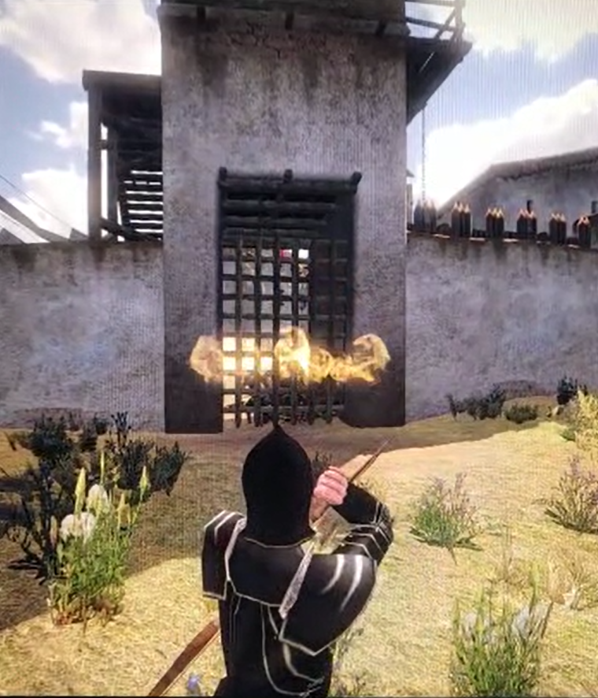

### Mod Description
This mod is inspired by Yberion (Steam-Name) who made a Native-compatible Mount and Blade Warband 
Tower defense mod back in the day. Bots spawn and try to kill the Players teams "King Harlaus" while players can try to survive 20 Waves. Players get rewarded for reaching kill-thresholds with increasingly powerful modded weapons (see fire arrows below), starting out just with throwing stones. If all 20 waves are completed players get bonus kills.
This mod isnt as extensive and polished as the original was, it was tested and is just working.  
Use this as baseline for improvements. 

### Editing Files and Setup Instructions

I edited all the `.py` files using **Notepad++**, but feel free to use any editor you prefer. To ensure everything runs correctly, you’ll need to adjust some file paths since you’ll likely save the folders in a different location than I did.

I followed the tutorial below and found it quite understandable. It might take around **20 minutes** to get everything running, but it's worth the effort.

#### Useful Resource for Troubleshooting
The Taleworlds Forum is a valuable resource for troubleshooting any errors you encounter:

**[The Ultimate Introduction to Modding: Starting Out](https://forums.taleworlds.com/index.php?threads/the-ultimate-introduction-to-modding-starting-out-read-this.240255/)**

There are also online resources that explain what each file does. With the **50,000 lines of code**, I rely on comments and the search function (`Ctrl-F`) to navigate. Additionally, I always keep the following files open:

- `header_operations`
- `module_constants`
- `header_triggers`
- `header_common`

This helps me remember what each command does. **Notepad++** is particularly useful because you can open these files in a second view and easily switch between them using tabs.

#### Files I’ve Edited (in order of importance):

1. **`module_mission_templates.py`**  
   This file contains the code executed during the multiplayer game and calls scripts from `module_scripts.py`.

2. **`module_scripts.py`**

3. **`module_items.py`**

4. **`module_troops.py`**

5. **`module_strings.py`**

6. **`variables.txt`**

7. **`module_constants.py`**

Additionally, I edited the **`Sample_Team_Deathmatch.txt`** file in the Server folder, and the **`Sample_Team_Deathmatch.bat`** file has been modified because **WSE** is installed.

#### Custom Map
A custom map with borders that guide the enemy bots is needed for the game to work. A already edited example map is included. Taleworlds community created a map-editor.

#### Prevent Progress Loss

The mod contains functionality to store a players kills (1 gold = 1 kill) in a external database via HTTP requests. Upon the player joined event the gold gets loaded from the database and the player is equipped accordingly prevent progress loss in this mod.
Follow the changes in module_scripts and setup a database (eg mySql DB) thats compatible and available to the machine, where the server runs on. To make this work: while Steam still supports this, players can be uniquely identified through a player uid. This and the gold are the minimum required fields to be stored in the external database.

#### Names of all used Original Resources (to search for):  
Adimi Tools 1.5.2 1.173  
Main File-3478-1-0-1  
mb_warband_1174.exe  
mb_warband_dedicated_1174  
mb_warband_module_system_1166_lav  
mb_warband_module_system_1171  
Morghs_MB_WB-WFAS_Editor_v1_50  
OpenBRF  
quick_scene_chooser_files  
WSE v4.8.4  
